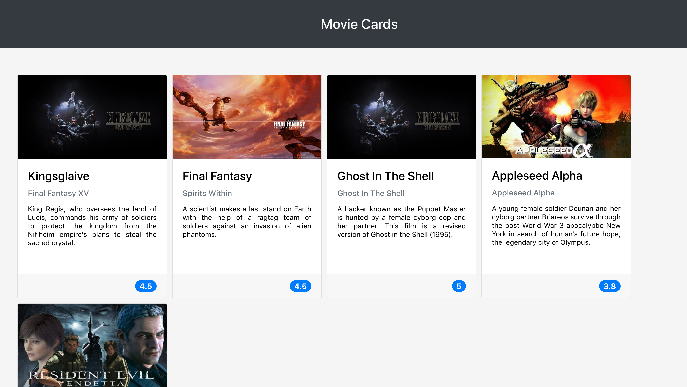

# Projeto Movie Cards Library

## Contexto

Neste projeto, foi desenvolvido uma biblioteca de cartões de filmes utilizando React. A biblioteca possui um cabeçalho e uma lista de cartões. Cada cartão representa um filme e possui uma imagem, título, subtítulo, sinopse e avaliação. A biblioteca é renderizada parecida com a imagem abaixo.



## Técnologias usadas

Projeto desenvolvido em React.

## Habilidades desenvolvidas

Neste projeto, pude desenvolver as seguintes habilidades:

  - Saber a melhor forma para instalar um gerenciador de pacotes
  - Inicializar um projeto em **React**
  - Utilizar JSX no **React**
  - Utilizar o **ReactDOM.render** para renderizar elementos numa página web
  - Utilizar o `import` para usar código externo junto ao seu
  - Criar componentes **React** corretamente
  - Fazer uso de `props` corretamente
  - Fazer composição de componentes corretamente
  - Criar múltiplos componentes dinamicamente
  - Utilizar **PropTypes** para checar o tipo de uma prop no uso de um componente
  - Utilizar **PropTypes** para garantir a presença de props obrigatórias no uso de um componente
  - Utilizar **PropTypes** para checar que uma prop é um objeto de formato específico
  - Utilizar **PropTypes** para garantir que uma prop é um array com elementos de um determinado tipo

## Executando aplicação

1. Clone o repositório
  * `git clone git@github.com:LucasAccurcio/movie-cards-libray.git`.
  * Entre na pasta do repositório que você acabou de clonar:
    * `cd movie-cards-libray`

2. Instale as dependências
  * `npm install`

## Executando a aplicação

* Para rodar a aplicação:

  ```
    npm start
  ```